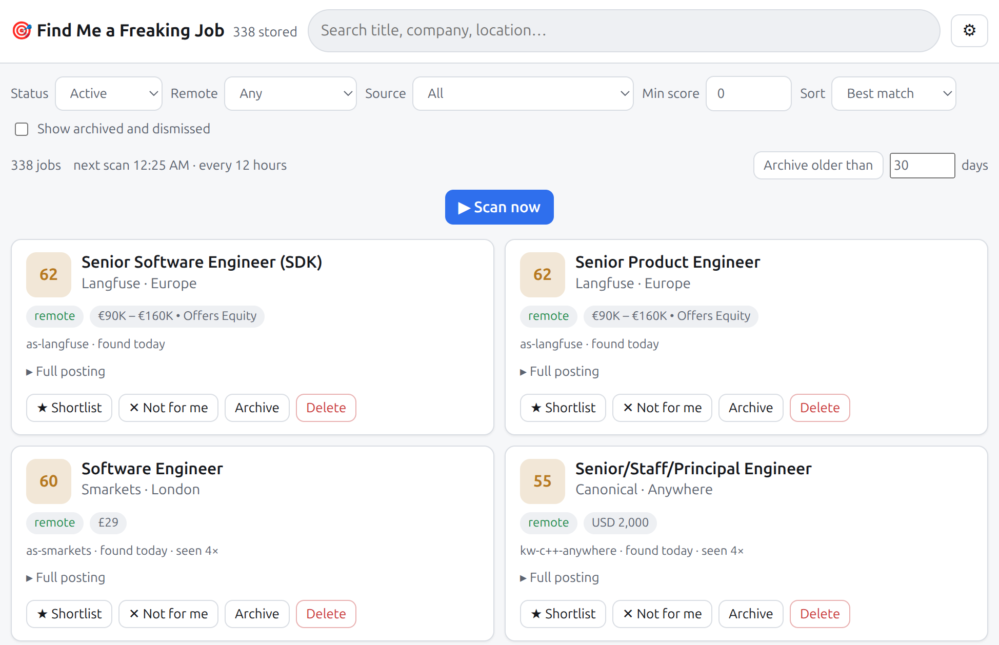

<p align="center"></p>

## Introduction

A job-search assistant that runs on your own machine. On a schedule you set — every hour, every six hours, once a day, whatever suits — it collects fresh postings from job boards and company career pages, reads each one against your CV and your preferences, scores it, explains why, and puts the results in a web page you can open from your desk or your phone.

The reading is done by a language model running locally through llama.cpp and opencode, so your CV and your preferences never leave the machine. The only outbound traffic is the requests to the job boards themselves. 

Which model is up to you and your hardware; on an NVIDIA RTX 4090 with 24 GB of VRAM, Qwen 3.8 27B is an optimal choice.

What you get:

- **A ranked list** of jobs with a score from 0 to 100, a short summary, the salary if the posting states one, and a plain-language note on whether you are actually eligible (visa, location, contract shape).
  
- **Reasoning, not keyword matching.** A posting that lists your skills is not necessarily your job, and a job you would be good at does not always use your words. You describe your experience and what you want in plain language — the technologies you know well versus the ones you have only touched, the kind of work you want more of and less of — and the model reads that every time it judges a posting, instead of counting keywords.
  
- **A growing set of sources.** It starts from a list of boards and learns new company career pages from the postings it finds, so coverage widens by itself over time.
  
- **A web app** to browse, search, filter, shortlist, mark as applied, archive and delete.

## Architecture

The architecture is described in [doc/Architecture.md](doc/Architecture.md).

> [!CAUTION]
> The entire project was "vibe coded" 🤡 — written by an AI assistant in conversation, with only the tech stack choices made by a human. Use it at your own risk.

## What you need

- A Linux machine with an NVIDIA GPU that can run a language model, and [Docker](https://docs.docker.com/engine/install/) installed **with GPU access**: the [NVIDIA Container Toolkit](https://docs.nvidia.com/datacenter/cloud-native/container-toolkit/latest/install-guide.html) lets the container use the GPU, and the model server runs inside it. Install Docker, install the toolkit, then `sudo nvidia-ctk runtime configure --runtime=docker && sudo systemctl restart docker`. Check it with `docker run --rm --gpus all nvidia/cuda:12.4.1-base-ubuntu22.04 nvidia-smi`, which should print your GPU
- About 20 GB of disk for the model, and the time to download it once
- Your CV as a PDF, Markdown or text file

Everything else — the model server (a llama.cpp fork, compiled for your GPU), Python, opencode, the web toolchain — is inside the container. Nothing is installed on the machine itself.

## 1. Install

```bash
git clone --recurse-submodules git@github.com:kineticsystem/find-me-a-freaking-job.git
cd find-me-a-freaking-job
./docker/dock.sh jobfinder build
```

That builds the image (web app, opencode, Python dependencies) and then compiles the llama.cpp fork for your GPU, which takes several minutes the first time and is not repeated. Your configuration and data stay in this directory on the host, so rebuilding never touches them. `jobfinder` is just the container's name; pick any.

The model itself is downloaded on the first start, into `~/.cache/huggingface` on the host, where it stays.

## 2. Tell it who you are

Everything the model knows about you comes from three things, all set from the web app. Until all three are done the app shows a checklist at the top of the page and does not scan at all — no postings are fetched until it knows who it is working for.

Your own files — `config/settings.yaml`, `profile/notes.md` and your CV — are created on first start from the `.example` templates and are git-ignored: nothing personal is ever committed, and pulling new versions of the code never touches them. Your preferences are kept in the database (one set per user), edited in the web app.

### Your CV

⚙ → *Your profile* → *Upload CV*. PDF, Markdown or text. It is stored as `profile/cv.<ext>`; uploading again replaces it.

### Your notes

⚙ → *Your profile* → *Your notes*. Free text, in your own words; the model reads it exactly as written every time it judges a posting, alongside your CV. This is where everything that is a matter of judgement rather than a hard rule goes: what you want more of and less of, how your experience should be read (the technologies you know well versus the ones you have only touched), what kind of company suits you, how you can be contracted. Be blunt; the model is told to be.

### Your preferences

⚙ → *Your preferences*. Structured facts and hard limits, validated as you save and stored in the database. (Upgrading from a version that kept them in `config/preferences.yaml`: the file is imported on the first start and renamed to `.imported`.)

| Field | What it does |
|---|---|
| Based in, citizenship, work authorisation | Drive the eligibility judgement — can you legally and practically take this role from where you are? |
| Titles, seniority | The roles you are after |
| Markets | Where to search, in order, and whether each needs to be remote. The first wins ties; later ones still surface |
| Must have, nice to have | Skills a posting should ask for |
| Dealbreakers | Anything here caps a posting's score at 20 |
| Salary floor | Postings below it are penalised |

Change any of this later and every stored job is re-scored on the next scan, with the old scores kept in history.

### Where to look — sources

Nothing to do up front: the shipped list of job boards and company career pages works as is, and every scan discovers more company boards from the postings it finds.

To follow a specific company, open the web app, ⚙ → *Where it looks*, and paste its careers page — any URL. Most company career pages are a job board underneath (Greenhouse, Lever, Ashby or Workday), even when the page hides it behind JavaScript; the app finds the board, checks it answers, and registers it, so you get every opening, structured, with its own apply link. A page with no board behind it is registered as a web page: on every scan it is rendered in a headless browser and the model reads the text to extract the roles it lists. The same section lets you switch any source off, or remove one that only produces noise.

`config/sources.yaml` is the seed list used on a fresh install; edit it if you want companies followed from day one. Whether a source is on or off is decided in the web app and is not overwritten by the file.

### The model — `config/settings.yaml`

The model server's exact command line — which model, context size, cache types — is `bin/llama-server.sh`; edit it to change the model. The `llm` section of `config/settings.yaml` (created from `settings.example.yaml` on first start) has to agree with it:

```yaml
llm:
  base_url: http://127.0.0.1:8084/v1
  model: Qwen3.8-27B            # the --alias in bin/llama-server.sh
  context_tokens: 120000        # what the server's slot holds (check /slots)
```

As shipped it runs Qwen 3.8 27B, which fits a 24 GB card.

## 3. Start it and check the wiring

```bash
./docker/dock.sh jobfinder start
./docker/dock.sh jobfinder shell -c 'jobfinder.sh doctor'
```

`start` brings the model server and the app up in the background; the model takes a few seconds to load. On the very first start your config files are created from the examples. `doctor` confirms the database exists, opencode answers, the model is reachable and your CV was read. Fix anything it flags before continuing.

## 4. First run

```bash
./docker/dock.sh jobfinder run
```

The first run does more than later ones: it distils your CV and notes into a profile (about 30 seconds), fetches from every source, scores everything it kept, and deep-dives the best. Expect it to take a while — the time is almost all model inference, so it scales with your model and GPU; subsequent runs only evaluate postings they have not seen. Follow it with `./docker/dock.sh jobfinder logs`.

To see it fetch without spending any inference time:

```bash
./docker/dock.sh jobfinder run --no-llm
```

When it finishes, a readable report is in `runs/latest-digest.md`.

## 5. The web app

<p align="center"></p>

The server you started in step 3 is the long-running process. It runs the search on the interval set by `interval_minutes` in `config/settings.yaml` (720 — twelve hours — as shipped; change it from the ⚙ settings in the web app or here) and serves the web app and its API on one port. Open:

**http://127.0.0.1:8099/**

The app follows your device's light or dark theme; ⚙ → *Appearance* forces Light or Dark, remembered per browser. Search, filter by status / remote type / source / minimum score, sort by best match, newest or company. On each job: **Shortlist**, then **Applied**; **Not for me** when it is wrong for you; **Archive** to get it out of the way; **Delete** for junk. **Archive older than N days** clears out stale postings in one click without touching anything you shortlisted. **Scan now** triggers a search immediately; while a scan runs, a progress bar under the button shows the stage, how far through it is, and a time estimate, and the button becomes **Stop scan**. Stopping is safe: everything scored so far is kept, and the next scan carries on from there — postings are never stored twice, and only postings without a score get scored.

**Not for me** asks why — tap a chip or two (*salary too low*, *on-site*, *agency / consultancy*, *wrong stack*…) and optionally a few words — and that is the one action that teaches the system. The reasons for your recent dismissals are shown to the model every time it scores a posting, as guidance about your taste, so the same kind of job stops scoring well. Archive carries no such signal: it just means "done with this one".

Job postings expire, and the archive-by-age feature exists for that reason: the tool records when it last saw each posting, so anything not seen for a while is probably gone.

### From your phone

The container listens on every interface: open `http://<this machine's IP>:8099/` from any device on your network.

For access from outside your network, put it behind a [Cloudflare Tunnel](https://developers.cloudflare.com/cloudflare-one/connections/connect-networks/) or [Tailscale](https://tailscale.com) rather than forwarding the port: the API has no login, and it can delete.

### Cloudflare Tunnel

To try it right now, with no account or domain — the URL is random, changes every run, and works for anyone who has it, so only for a quick look:

```bash
cloudflared tunnel --url http://localhost:8099
```

For something permanent on your own domain, with a login in front of it:

```bash
cloudflared tunnel login                               # opens a browser; pick your domain
cloudflared tunnel create jobs                         # tunnel + credentials in ~/.cloudflared
cloudflared tunnel route dns jobs jobs.yourdomain.com  # DNS record pointing at the tunnel
cloudflared tunnel run --url http://localhost:8099 jobs
sudo cloudflared service install                       # run it as a system service from now on
```

Then in the Cloudflare dashboard, Zero Trust → Access → Applications, add `jobs.yourdomain.com` with a policy that allows your email. That puts a one-time-code login in front of the app, which it does not have on its own.

### Keeping it running

The container restarts itself after a crash or a reboot until you `./docker/dock.sh jobfinder stop` it. The database is a single file at `data/jobs.db`; back that up and you have everything.

## Settings you may want to change

All in `config/settings.yaml`:

| Setting | Default | Meaning |
|---|---|---|
| `interval_minutes` | 720 | How often the search runs, in minutes — also editable from the ⚙ settings in the web app, no restart needed |
| `run_on_start` | true | Run once as soon as the container starts |
| `limits.deepdive_min_score` | 65 | Postings scoring at least this get the full analysis |
| `limits.deepdive_top_n` | 10 | …but at most this many per run |
| `limits.max_jobs_per_run` | 300 | Cap on newly stored postings per run |
| `api.host`, `api.port` | 127.0.0.1, 8099 | Where the server listens |

Edit, then `./docker/dock.sh jobfinder stop` and `start` again.

### Starting over

At the bottom of ⚙ Settings, in red: **Delete all jobs** clears every posting, score, decision and run but keeps your sources, CV, notes and preferences, so the next scan starts the search from scratch with the same setup. **Reset everything** also drops the sources back to the seed list. Both make you type `DELETE` and refuse to run during a scan. Neither touches the files.

## Tests

```bash
./docker/dock.sh jobfinder test
```

Runs every test against a throwaway instance — its own config, a fictional CV, fictional postings, port 8098 — and removes it afterwards. It never touches your data.

## Useful commands

```bash
./docker/dock.sh jobfinder logs                      # follow the server log
./docker/dock.sh jobfinder shell                     # a shell inside the container
./docker/dock.sh jobfinder stop                      # stop the server
./docker/dock.sh jobfinder build                     # rebuild after pulling new code
./docker/dock.sh jobfinder clean                     # remove container and image; your data stays
```

Inside the container (`shell`), or through `shell -c '...'`:

```bash
jobfinder.sh jobs --min-score 70 -l   # ranked list in the terminal
jobfinder.sh runs                     # run history
jobfinder.sh sources                  # every source, including discovered ones
jobfinder.sh profile                  # the digest the model built from your CV
jobfinder.sh profile --force          # rebuild it
test.sh                               # the API tests
```

## When something looks wrong

Every run leaves a full record in `runs/<timestamp>/`: each prompt sent to the model, each reply, and the JSON it produced. If a score does not make sense, that directory shows exactly what the model was told and what it said.

`doctor` covers the common failures: model server down, no CV in `profile/`, a wrong `llm.base_url`.

A broken `config/preferences.yaml` or `config/settings.yaml` (a typo while editing by hand) stops the app from starting, on purpose: it will not run on values it was not given. `./docker/dock.sh jobfinder start` then prints the reason — the file, the line and column, or the invalid field — and the fix is to correct the file and start again. Files saved from the web app are always valid; this only happens after hand edits. `./docker/dock.sh jobfinder shell -c 'jobfinder.sh check'` validates the files on demand.

