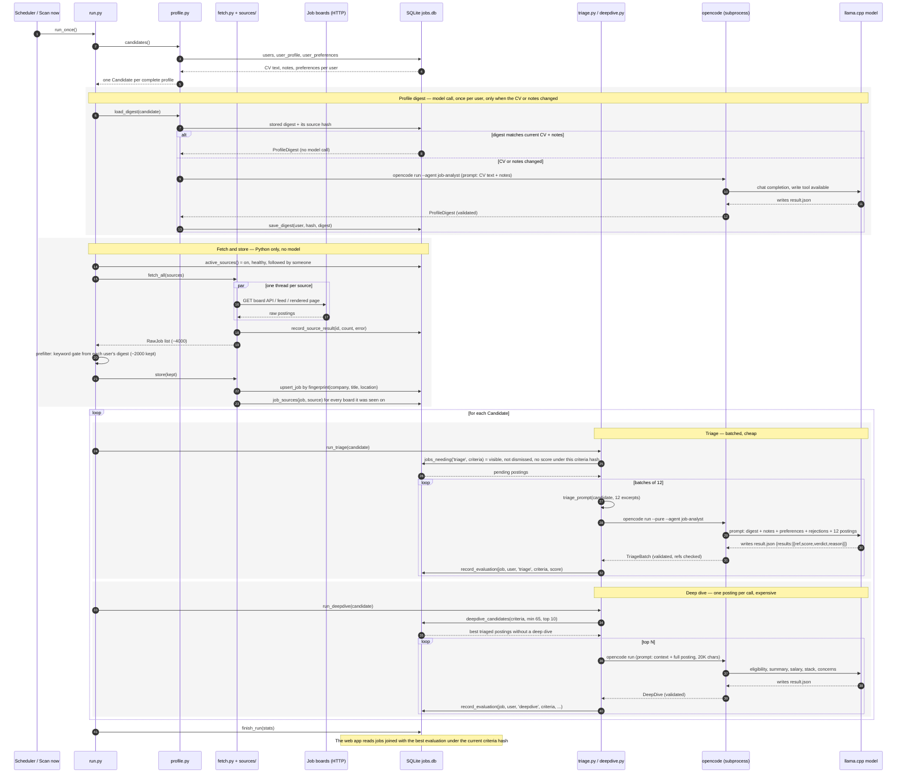

# How a posting is retrieved and scored

A walk through one scan, from a job board to a score on a card, with the three parts kept apart: the Python pipeline that fetches and stores, the model that judges, and opencode, which sits between them. Read `Architecture.md` for the whole system; this is the one path, in order.

## The short version

The scan is deterministic Python everywhere except two moments: when the model is asked to *understand* something. Fetching, deduplicating, filtering and storing never involve a model. The model sees a posting only after it is already in the database, and only to answer one question about it: how well does it fit this candidate. Its answer is written back as a row. Nothing the model says changes what is stored about the posting itself.

opencode is the way the model is called. The pipeline never speaks HTTP to llama.cpp for scoring; it writes a prompt, starts one `opencode run` process per judgement, and reads one JSON file back. opencode is the agent runtime that hands the prompt to the model, gives it a `write` tool, and stops when the model has written `result.json`.

The database is the only state. A posting, a user's decisions on it and every score it has ever received live in SQLite; a run reads its work from there and writes its results there. The model has no memory between calls; the database is what makes the search incremental.

## The sequence

 
Mermaid source

## Step by step

### 1. Who the search is for

`run_once` starts by asking `profile.py` for the candidates: every account whose CV, notes and preferences are all present. Those three things come from the database (`user_profile`, `user_preferences`), and from them a `Candidate` object is built. It carries the CV text, the notes, the preferences, and two hashes derived from them: the *source hash* (CV + notes) and the *criteria hash* (source hash + preferences). The criteria hash is the identity of "what a good job means for this person right now". Every score is stamped with it.

If nobody has a complete profile the run ends here, before any network request.

### 2. The profile digest (first model call)

A CV is a few thousand words; every judgement needs it, and the model's context is finite. So once per user the CV and notes are distilled into a `ProfileDigest`: headline, years, seniority, core and secondary skills, domains, recent roles, and a list of search keywords. About 800 tokens. It is stored on the user's `user_profile` row together with the source hash it was made from, and rebuilt only when that hash changes, i.e. when the CV or the notes are edited. On most runs this step is a database read.

This is the first place opencode appears, and it works the same way every time it appears:

1. The pipeline writes a prompt: instructions, the input, and the exact JSON schema expected.
2. It runs `opencode run --pure --dir <workdir> --agent job-analyst -m <model> --auto --format json "<prompt>"` as a subprocess, with a generated configuration file that names the llama.cpp endpoint as the only provider and disables every plugin, MCP server and LSP.
3. The `job-analyst` agent (`.opencode/agent/job-analyst.md`) is allowed the `write`, `edit` and `read` tools and nothing else: no shell, no web. Its instructions say to write one file, `result.json`, and stop.
4. opencode sends the prompt to the model through the OpenAI-compatible API llama.cpp exposes, lets the model call the write tool, and exits.
5. The pipeline reads `result.json` and validates it against a Pydantic model. Anything else, an empty file, malformed JSON, a missing field, is a failed attempt: the prompt is re-sent with the error appended, up to `max_retries` times. opencode's own stdout is never used as a result.

Everything about the call is kept under `runs/<timestamp>/<session>/`: the prompt, opencode's stdout and stderr, and the file the model wrote. When a score looks wrong, that directory says why.

### 3. Fetch (no model)

`active_sources()` returns every registry row that is on, not paused after repeated failures, and followed by at least one user. `fetch_all` runs one adapter per source in a thread pool: Greenhouse, Lever, Ashby and Workday boards through their JSON APIs, aggregators through their feeds, a plain careers page through a headless browser. Each adapter returns `RawJob` records; a failing board is recorded against that source and does not stop the run. Keyword queries built from each user's digest (the Jobicy searches) run here too, one set per user.

A typical run brings back about 4,000 raw postings.

### 4. Prefilter and store (no model)

The prefilter is a Python keyword gate built from each user's digest and preferences. It drops what is obviously for someone else before any model time is spent; with several users a posting is kept if it passes for any of them. About half survive.

`store()` writes every survivor. A posting is identified by a fingerprint of normalised company, title and location, so the same job on two boards is one row in `jobs`, and `job_sources` records every board it was seen on. A posting seen before has its `last_seen` refreshed; a new one gets a row. Nothing is capped at this stage: a cap here once silently dropped whichever boards the threads finished last.

From this point the posting exists independently of any user. What follows is per user.

### 5. Triage (second model call, batched)

For each candidate, `jobs_needing('triage', criteria)` selects the postings this user can see (one of its sources is in their list), that they have not dismissed or archived, and that have **no evaluation under the current criteria hash**. That last condition is what makes scoring incremental: a posting scored last week under the same CV and preferences is not scored again; a posting scored under an old preferences file is.

The pending list is cut into batches of 12. Each batch is one opencode session. The prompt is the same context block every time, the candidate's digest, their notes verbatim, their preferences as rules, the market order, and their recent dismissals with reasons, followed by 12 short entries: company, title, location, salary if stated, and a 700-character excerpt, each with a `ref` number. The model answers with a score 0–100, a verdict of strong, maybe or reject, and a one-line reason per ref. Refs it invents or repeats are discarded. Each accepted answer becomes a row in `evaluations` with the user id, the stage `triage`, the criteria hash and the run id.

Twelve per call is the balance between context (the shared block is a few thousand tokens; twelve excerpts add about as much again) and cost (one model call per twelve postings rather than per one).

### 6. Deep dive (third model call, one posting each)

`deepdive_candidates` takes this user's postings with a triage score of at least `deepdive_min_score` (65) and no deep dive under the current criteria, best first, at most `deepdive_top_n` (10) per run. Each is one opencode session with the same context block and the full posting text, up to 20,000 characters. The model returns an explicit eligibility judgement (can this person legally and practically take the role, given where they are based and their citizenship), a summary, the salary if it can find one, the tech stack, concerns, and a score with a rationale. That becomes an `evaluations` row with stage `deepdive`.

Both stages honour Stop between units; an opencode process in flight is killed and the run is recorded as stopped with everything scored so far kept.

### 7. What the card shows

The web app never sees the model. `GET /jobs` runs one query that joins each visible posting with its best evaluation for the requesting user: a deep dive supersedes the triage score it came from; the triage score stands until one exists; a posting with no score under the current criteria but a score under an older one shows that older score faded, flagged stale, until the next scan replaces it. Dismissing, shortlisting, applying and declining write to `user_state`, which no scan ever touches.

## The three roles in one table

| | Does | Never does |
|---|---|---|
| Python pipeline | fetches, deduplicates, filters, stores, decides what needs scoring, validates every answer, records it | judges fit |
| opencode | runs one model session per judgement in a clean process with a fixed agent and one tool, hands back a file | keep state, choose what to score, talk to the database |
| Model (via llama.cpp) | reads the context block and the postings, writes a JSON answer | see the database, fetch anything, remember a previous call |
| SQLite | holds postings, sources, users, profiles, decisions and every evaluation with its criteria hash | hold anything derived that cannot be rebuilt from it |

## Why it is built this way

**Scores are facts about a (posting, user, criteria) triple, not about a posting.** Storing them that way is what lets a CV change re-score everything without deleting anything, lets two users see different scores on the same row, and lets the history be inspected.

**The model is called through a file contract.** A subprocess that must write `result.json` matching a schema is easier to make reliable than a streaming chat response: an answer either validates or the call is retried with the error shown to the model. It also makes every call auditable after the fact.

**opencode rather than a direct API call.** The tool-calling loop, the agent definition, the provider configuration and the process isolation come for free, and the same runner serves the explorer agent, which is allowed to fetch web pages. The price is a ~15K-token system prompt per session and a process start; for a batch of twelve postings that is acceptable, and the batching exists partly to amortise it.

**Nothing is scored before it is stored.** The database is the queue. A scan interrupted at any point loses nothing: what was fetched is stored, what was scored is recorded, and the next scan picks up the rest because "needs scoring" is a query, not a list held in memory.
