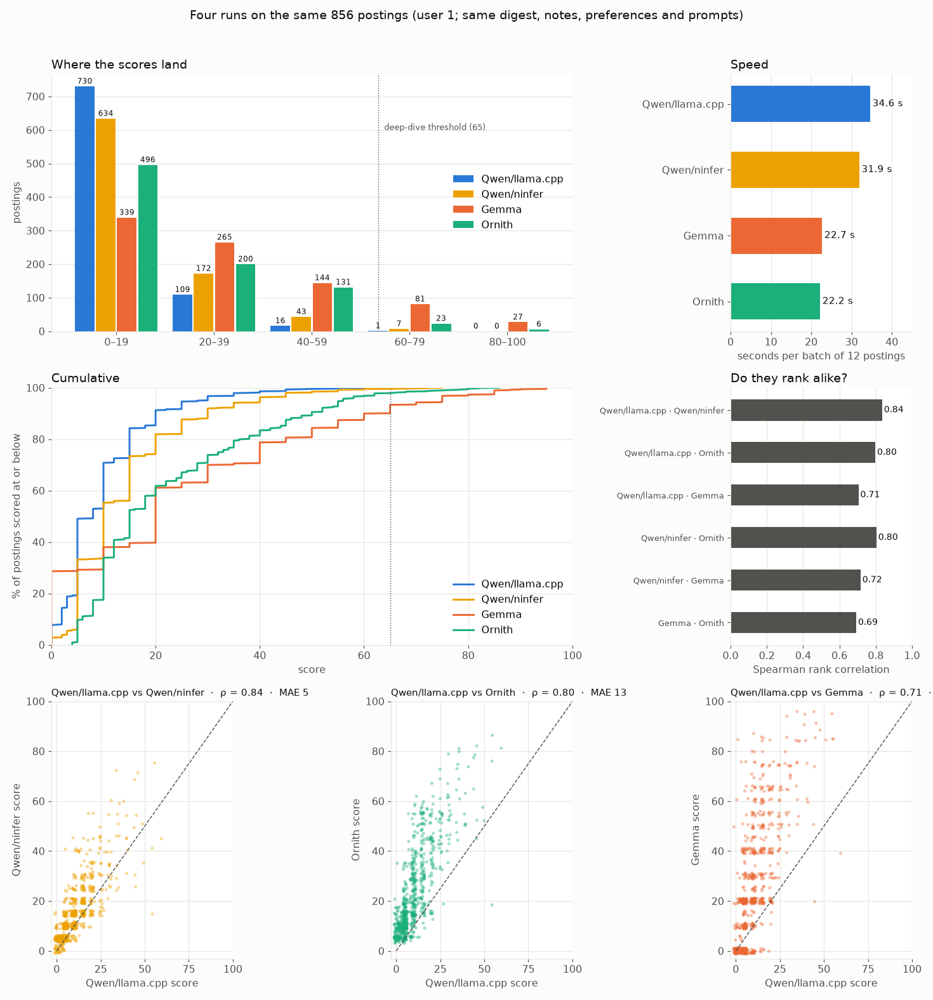

# Four runs on the same postings: Qwen3.8-27B on two engines, Gemma4-12B, NVIDIA Ornith-1.5-35B-A3B

A test run on 2026-09-21, not a permanent part of the project. The same 856 postings, the same profile digest, notes and preferences (user 1), the same prompts, scored once by each of four setups. Nothing was fetched; each run wrote under its own criteria hash so the others stayed in place.

| Run | Model | Engine | Why |
|---|---|---|---|
| Qwen/llama.cpp | Qwen3.8-27B, unsloth UD-Q4_K_XL | llama.cpp (the fork the container builds) | the scores the app has been using |
| Qwen/ninfer | Qwen3.8-27B, ninfer's own format | ninfer-serve | same weights family, different runtime: a control for how much the engine and sampling alone move a score |
| Gemma | Gemma4-12B | llama.cpp | a smaller, faster model |
| Ornith | NVIDIA Ornith-1.5-35B-A3B, Q4_K_M | llama.cpp | a mixture of experts with 3B active |

## How to read the figure

**Where the scores land (top left).** Each run's scores in five bands. Both Qwen runs keep most postings under 20; the ninfer run is a little more generous (7 postings in the 60s, 4 at or above the deep-dive threshold, against 0 on llama.cpp). Ornith sits between the Qwens and Gemma; Gemma spreads across the whole range.

**Speed (top right).** Seconds per triage batch of twelve, from the same log lines for all four. Qwen on ninfer is 8% faster than Qwen on llama.cpp; Gemma and Ornith are about 1.5× faster than either.

**Cumulative (middle left).** The share of postings scored at or below each value. The two Qwen curves run close together; Ornith and Gemma are clearly further right.

**Do they rank alike? (middle right).** Spearman rank correlation per pair. The important bar is the first one: the same model on two engines agrees with itself at 0.84. That is the ceiling for this kind of comparison, and Ornith against either Qwen run is 0.80, just under it.

**Bottom row.** Qwen on llama.cpp against each of the others, one dot per posting. The ninfer cloud hugs the diagonal; Ornith's is above it but tight; Gemma's is above it and wide.

## The numbers

| | Qwen/llama.cpp | Qwen/ninfer | Gemma | Ornith |
|---|---|---|---|---|
| mean / median score | 10.1 / 8 | 14.3 / 10 | 24.9 / 20 | 22.6 / 15 |
| standard deviation | 9.1 | 11.7 | 24.0 | 17.1 |
| highest score | 60 | 75 | 95 | 86 |
| verdicts strong / maybe / reject | 0 / 39 / 817 | 3 / 60 / 793 | 65 / 204 / 587 | 13 / 207 / 636 |
| postings at or above 65 | 0 | 4 | 108 | 29 |
| deep dives triggered | 0 | 4 | not run | 10 |
| seconds per batch of 12 (mean) | 34.6 | 31.9 | 22.7 | 22.2 |
| batch time range | | 18–62 | 10–42 | 10–51 |

| Pair | Spearman ρ | Kendall τ | same verdict | identical score | mean abs. diff. | within 10 / 20 pts | top-20 / 50 / 100 shared |
|---|---|---|---|---|---|---|---|
| Qwen/llama.cpp · Qwen/ninfer | **0.84** | 0.72 | 94% | 28% | 5.4 | 89% / 97% | 9 / 26 / 61 |
| Qwen/llama.cpp · Ornith | 0.80 | 0.65 | 77% | 4% | 12.9 | 59% / 80% | 10 / 27 / 56 |
| Qwen/ninfer · Ornith | 0.80 | 0.67 | 79% | 14% | 9.3 | 70% / 88% | 11 / 29 / 68 |
| Qwen/ninfer · Gemma | 0.72 | 0.59 | 72% | 8% | 14.9 | 61% / 76% | 8 / 20 / 51 |
| Qwen/llama.cpp · Gemma | 0.71 | 0.58 | 70% | 9% | 17.3 | 51% / 71% | 9 / 28 / 49 |
| Gemma · Ornith | 0.69 | 0.55 | 74% | 6% | 12.7 | 58% / 84% | 8 / 22 / 57 |

## The control: the same model disagrees with itself

The Qwen-on-ninfer run is the most useful number in this document, because it is nearly the same thing twice. The weights are the same family (a different quantisation, since ninfer has its own format), the prompts are identical, and still: only 28% of postings got the identical score, the average gap is 5.4 points, the rank correlation is 0.84, and on the first page of results only 9 of the top 20 are shared. Sampling at temperature 0.6, a different quantisation and a different engine together account for that much. Anything under about 0.85 in the table above is therefore within the range where "a different model" and "the same model on a different day" are hard to tell apart in ranking; what separates the models is the *scale* they use, and that is not noise.

Read that way: Ornith ranks the postings essentially as Qwen does (0.80 against either Qwen run, against a 0.84 ceiling) while placing them on a scale where the top ones reach the deep dive. Gemma is a genuinely different judge (0.71, with the widest cloud) and the most generous by far.

## What each run put at the top

Ornith's top ten and what its deep dives then said:

| Q/llama | Q/ninfer | Gemma | Ornith | Posting | Ornith deep dive |
|---|---|---|---|---|---|
| 55 | 75 | 85 | 86 | ClickHouse, Principal Database Performance Engineer | 46, eligible |
| 60 | — | 40 | 82 | Discourse, Senior Robotics Architect (ROS 2) | 68, eligible |
| 45 | — | 85 | 82 | Grafana Labs, Staff Backend Engineer | 54, eligible |
| 35 | — | 85 | 80 | Tiugo Technologies, Principal Product Engineer | 12, not eligible |
| 35 | 60 | 85 | 80 | Grafana Labs, Staff Backend Engineer (second listing) | 20, not eligible |
| 30 | 60 | 75 | 80 | DeepL, Senior Software Engineer, Full-Stack | 20, not eligible |
| 45 | — | 75 | 79 | Toggl, Senior Full Stack | 82, eligible |
| 45 | 72 | 90 | 78 | Track it Forward, Lead Developer | 12, not eligible |
| 55 | — | 95 | 76 | UnoMove, Robotics Software Engineer | 60, eligible |
| 35 | — | 60 | 75 | Caspar Health, Senior Fullstack Engineer | 55, eligible |

Qwen on ninfer put ClickHouse (75), Cloudbeds Senior Software Engineer (72), Track it Forward (72) and Discourse's Robotics Engineer (68) above the threshold; its deep dives kept Cloudbeds (48) and ClickHouse (42) as eligible and marked the other two not eligible. Both engines' Qwen and Ornith agree on ClickHouse as a top posting; Gemma agrees too.

Every run that reached the deep dive had some of its top triage picks rejected there on the full text, which is the two-stage design working: the triage score is a cheap first opinion, the deep dive is the one that counts, and it is only reachable if triage lets anything through. On llama.cpp, Qwen has never let anything through.

## The score bands, as GitHub renders them

```mermaid
xychart-beta
    title "Postings per score band (856 postings)"
    x-axis ["0-19", "20-39", "40-59", "60-79", "80-100"]
    y-axis "postings" 0 --> 800
    bar [730, 109, 16, 1, 0]
    bar [634, 172, 43, 7, 0]
    bar [339, 265, 144, 81, 27]
    bar [496, 200, 131, 23, 6]
```

Bars in each group: Qwen/llama.cpp, Qwen/ninfer, Gemma, Ornith.

## What it says, and what it does not

**Switching engines does not fix Qwen.** ninfer is 8% faster and nudges the scale up a little (4 postings reach the threshold instead of 0), but the distribution is the same shape: most postings under 20, "reject" as the default. The engine is not what compresses the scale; the model, or the prompt as this model reads it, is.

**Ornith is the conservative upgrade.** Same ordering as Qwen to within the noise of Qwen against itself, a usable scale, 1.5× faster, and a deep-dive load (29 of 856, about 3%) that is affordable.

**Gemma is the different opinion.** Fastest with Ornith, but it is generous to the point of putting 108 postings through to the deep dive on this sample, some of them clearly wrong for the profile. The deep dive would sort them out, at the cost of about an hour per scan.

**None of this says which run is right about you.** Correlation between judges says whether they agree with each other, and the control shows how loosely even one judge agrees with itself. Thirty postings rated by hand, compared to each run, is the measurement that would settle it.
